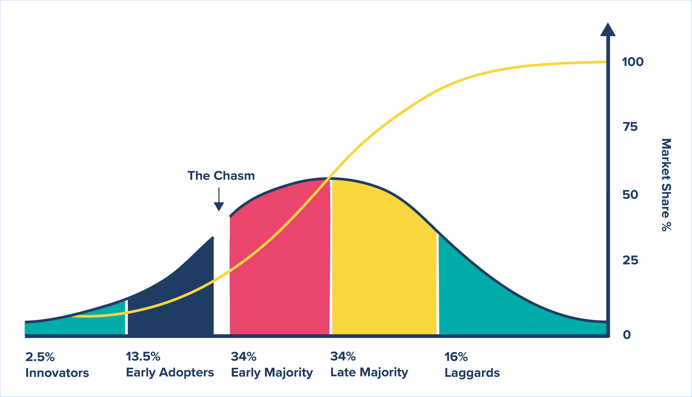

# 🤚 Background

Web3 is an inevitable paradigm shift for the Internet. As the world moves from the centralization to decentralization, the data, privacy and security should be fully owned by the user. The information sharing and distribution should also be controlled in the realm of the user, rather than some centralized authorities. We believe that web3 dapps have the following same characteristics in common.

### Protocol Composability

It allows different protocols and applications being combined permissionlessly to build new services, which would release unlimited possibilities.

### DAO Empowered

DAO has completely changed the way of social collaboration and resource integration. It plays an increasingly important role in web3 projects nowadays.

### Self-sovereign

Users have full ownership of their own data, identities, assets and social network. No one else can control, monitor, or block user’s operations.

### **Problems**

<figure><figcaption></figcaption></figure>

Until now Web3 is still for a small number of Early Web3 Adopters or Web3 Natives. As the industry evolves, we have the chance to fundamentally unleash the possibilities of Web3 to the early majority by providing an ultimate solution to rule them all. A portal is more secure, efficient and easy to use.

**For Web3 to cross the chasm and enter the mass market, we need to fundamentally solve following 3 problems:**

1. User Experience
2. Provide users with direct and visible values
3. Sustainable Commercial capablities

**From web3 social to everything else, Konnect is the one portal to rule them all ! Konnect is not only powered by a set of leading and innovative features, but also differentiate themselves by its unique business model called Konnect Model. In general, the Konnect Model is characterized by the following 3 consecutive layers:**

1. **Upper Layer:** A Social Wallet with industry-leading technologies
2. **Middle Layer:** KID Powered by ZKPs, Ktask, IK recommendation and etc
3. **Base Layer:** Konnect Social Graph and IM Protocol

### Vision

Create a trustworthy platform for valuable connections.

### **Mission**

To become the world's Top Web3 platform around 2025.

### **Positioning**

**For Business:** We provide a leading Web3 management base to help user growth and monetization.

**For Users:** We give a seamless and all-in-one platform to onboard billions of users to Web3.

**In a nutshell, we aim to establish the Wechat ecosystem in web3 era.**
