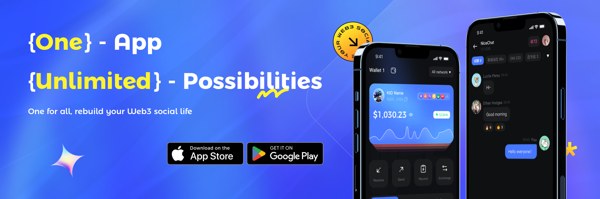

# 💞 What is Konnect?

Konnect is a Web3 social wallet and crypto trading management aggregator, as well as a portal for billions of users flowing from Web2 to Web3. Konnect is not a simple Web3 IM or wallet, but a platform bearing the wonders of users for the real lifestyles of Web3.

<figure><figcaption></figcaption></figure>

**The bullet points of Konnect are as follows:**

### **Konnect Social - Web3’s home to chat, discuss, and connect**

* Secure and censorship-resistant encrpted P2P communication
* Create communities, big or small, discover web3 communities that resonate with you.
* Chat with frens：Direct message frens by .eth name or wallet address. Or go further to message anyone on Ethereum
* Web3 native gating: control room access through POAPs, tokens, allowlists, NFT collections, or let anyone join
* Discover more social relations with our Konnect Social Graph Protocol

### **Konnect Wallet - Next Generation Wallet powered by ERC-4337 and MPC**

* EOA Wallet: Multi-chain EOA wallet for Web3 natives
* Seedless Onboarding: Easily log into dApps using everyday accounts like Email, Google, Twitter, and Facebook. A user experience that is familiar to you
* Non-custodial smart contract wallet for Gasless Experience: Any token can be used to pay for gas. You can also sponsor the gas so users don’t have to worry about it. No more loss of user to the gas hurdle
* Social recovery: Easy and reliable social recovery, enable users to manage wallets using emails by verifying email’s DKIM signatures. Fully on-chain. No need to trust us or rely on our service

We are helping to onboard the next 100 million mass users onto the Web3 ecosystem without barriers, allowing all users to get into the Web3 era smoothly, safely, and effectively.

### **Konnect ID - Create your true Web3 ID and get rewarded**

* DID: Every Konnect user will be able to create a unique decentralised digital identity(DID) on Konnect, thus the privacy of users be fully protected by blockchain technology and encryption algorithms. With DID, the user can explore all the services of Konnect freely and safely without complicated centralized KYC authentication.
* KID: A decentralized, privacy-focused credential network (Proof of Personhood) that utilizes zero-knowledge proofs (ZKPs) to enable secure and private credential issuance and verification to establish true Web3 identity
* Reward: Users with KID can get rewarded via an innovative Sociafi mechanism

With KID, we are creating the largest and real Web3 ID in our ecosystem.

### **KTask: Boost web3 collaboration**

Web3 projects today face an array of marketing challenges, including:

* Acquire new users
* Retain existing ones
* Improve the usage of dApps

KTask is a Web3 Collaboration and GTM Platform that brings users a deep Web3 experience, including reward campaigns, first-hand information on Web3 projects, and more. Ktask helps task initiators and implementers to collaborate efficiently and better align mutual interests. Ktask works with Konnect Social for initiators to better manage their users.

### **Konnect Recommend**

Konnect Recommend provides rich personalized experiences using the latest innovations in machine learning to push suitable and customizable dapps to users based on their on-chain and off-chain behaviors.

* Achieve higher retention, engagement, and revenue using our advanced ML models
* Explore flexible recommendation models that cater to DAOs/Projects' specific scenarios and goals
* Explore all you need to get started in an easy-to-use platform

Rather than offering the standard, 'out-of-the-box' choices, Konnect Recommend provides flexible solutions tailored to DAOs/Projects' specific goals and challenges, Konnect Recommend helps businesses to deliver tailored Web3 User experiences through personalized recommendations. Drawing on extensive experience in machine learning, our recommendations go beyond standard rule based recommendation services to deliver exceptional experiences across the entire customer journey.

Konnect Recommend is here to enhance every step of the user's Web3 journey with personalized recommendations.

### **Konnect Protocol**

Konnect Protocol is a decentralized social graph and IM protocol that helps Web3 applications bootstrap network effects.

* allows users to own their social identities, connections, and content on a social network. Additionally, the protocol provides a social data layer which can be used by developers to compose social features for their applications.
* an open, secure web3 communication infrastructure that powers decentralized user interactions - enabling users to chat, trade and socialize seamlessly within and across applications. We provide customized and easy-to-install chatting solutions for Web3 Gaming, Wallets and general Dapp developers.

Konnect Protocol would be first used in Konnect, and then introduced to the Web3 developers as our data accumulates to truly empower network effects.

### **Summary**

Konnect is a Web3 decentralized social wallet, as well as an one-stop management platform for Web3 social and encrypted assets. Konnect focuses on the demands of users in Web3, offering a secure, reliable and user-friendly self-custodial service for Web3 social and encrypted assets.

Konnect introduces some innovative features to fundamentally lower the barriers for Web3 masses and gives users an easy-to-use experience in Web3.
